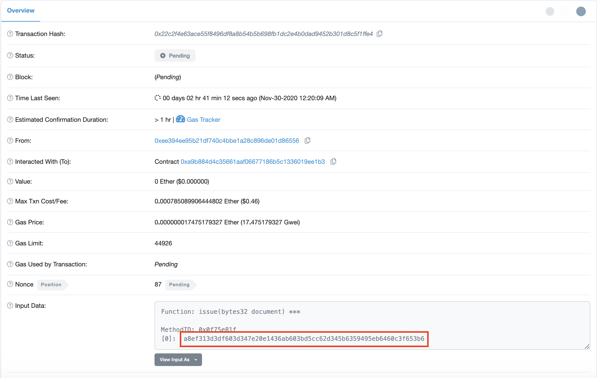

# Transaction Plunger

Use this to try to unblock transactions by replacing with a trasaction using same nonce and higher gas price. 

## Install


```
virtualenv .venv 
source .venv/bin/activate
pip3 install -r requirements.txt

```
## Set Up

The following environment variables need to be set up:

`PUBLIC_KEY`: public address of account sending the transaction
`PRIVATE_KEY`: private key of account sending the transaction
`CONTRACT_ADDRESS`: address of document store contract
`ETHEREUM_NODE_URL`: url for ethereum node RPC endpoint

# Run

pass merkle root in as command line argument when running, e.g.

```
python issue.py 8bd38e145b9c063156c8e9da9c924f5d25d2d52ac92177a7ba3cece186370994
```

You can get the merkle root for the transaction to replace from etherscan (by looking at the earliest pending transaction)



